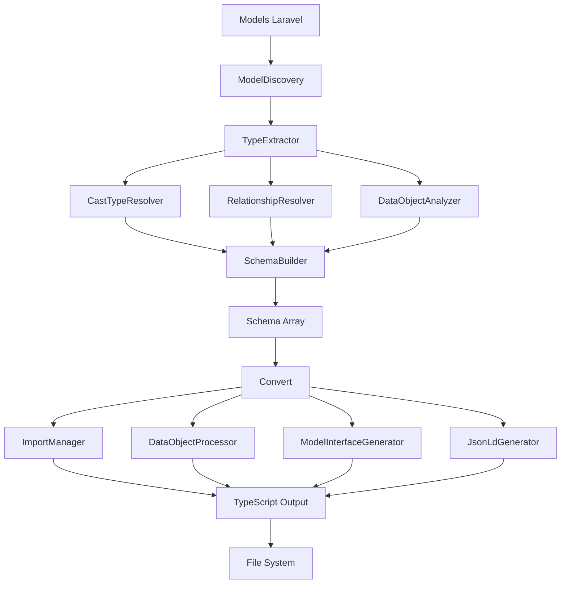

# Architecture du Package OI Laravel TypeScript

Ce document décrit l'architecture du package et la responsabilité de chaque composant.

## Vue d'Ensemble

Le package est organisé selon une architecture modulaire avec séparation des responsabilités. Chaque classe a un rôle spécifique dans le processus de conversion PHP → TypeScript.

```
src/Services/
├── Convert.php                           # Orchestrateur de conversion TS
├── Eloquent.php                          # Facade pour analyse des modèles
├── Converters/
│   └── TypeScriptTypeConverter.php       # Conversion de types PHP → TS
├── Generators/
│   ├── ImportManager.php                 # Gestion des imports TypeScript
│   ├── JsonLdGenerator.php               # Génération support JSON-LD
│   └── ModelInterfaceGenerator.php       # Génération interfaces modèles
├── Processors/
│   └── DataObjectProcessor.php           # Traitement des DataObjects
└── Eloquent/
    ├── ModelDiscovery.php                # Découverte des modèles
    ├── TypeExtractor.php                 # Extraction des types d'un modèle
    ├── SchemaBuilder.php                 # Construction du schéma global
    ├── RelationshipResolver.php          # Résolution des relations
    ├── CastTypeResolver.php              # Résolution des custom casts
    ├── DataObjectAnalyzer.php            # Analyse des DataObjects
    └── PhpToTypeScriptConverter.php      # Conversion types PHP → TS
```

## Architecture Modulaire

L'architecture suit le pattern **Facade + Services spécialisés**, avec deux pipelines principaux :

### Pipeline 1 : Eloquent (Analyse des Modèles)
```
Models Laravel
    ↓
ModelDiscovery → découvre les modèles
    ↓
TypeExtractor → extrait les types pour chaque modèle
    ├→ CastTypeResolver → résout les custom casts
    ├→ RelationshipResolver → résout les relations
    └→ DataObjectAnalyzer → analyse les DataObjects
    ↓
SchemaBuilder → construit le schéma complet
    ↓
Schema (array)
```

### Pipeline 2 : Convert (Génération TypeScript)
```
Schema
    ↓
Convert → orchestre la conversion
    ├→ ImportManager → collecte les imports
    ├→ DataObjectProcessor → traite les DataObjects
    ├→ ModelInterfaceGenerator → génère les interfaces
    └→ JsonLdGenerator → ajoute le support JSON-LD
    ↓
TypeScript File
```

---

## Composants du Pipeline Eloquent

### 1. Eloquent (Facade)
**Fichier**: `src/Services/Eloquent.php`

**Responsabilité**: Point d'entrée principal pour l'analyse des modèles Laravel.

**Rôle**:
- Facade statique pour simplifier l'API publique
- Configure et assemble les composants du pipeline
- Gère la configuration globale (customProps, additionalModels, withCounts)
- Délègue le travail aux services spécialisés

**Méthodes Publiques**:
```php
// Configuration
public static function setAdditionalModels(array $models): void
public static function setCustomProps(array $props): void
public static function setWithCounts(bool $withCounts): void

// Extraction
public static function getSchema(): array
public static function getModels(): array
public static function getTypes(string $modelClass): Collection
```

**Exemple d'Utilisation**:
```php
// Configuration
Eloquent::setAdditionalModels([CustomModel::class]);
Eloquent::setCustomProps([
    'User' => ['role' => 'UserRole'],
    '?status' => 'Status' // Global
]);

// Extraction
$schema = Eloquent::getSchema();
```

---

### 2. ModelDiscovery (Découverte de Modèles)
**Fichier**: `src/Services/Eloquent/ModelDiscovery.php`

**Responsabilité**: Découvre et collecte tous les modèles Eloquent de l'application.

**Rôle**:
- Scanne le dossier `app/Models`
- Intègre les modèles additionnels configurés
- Valide l'existence des classes
- Retourne un tableau normalisé de métadonnées

**Méthodes Clés**:
```php
public function setAdditionalModels(array $models): void
public function discoverModels(): array
private function scanModelsDirectory(): array
private function processAdditionalModels(): array
```

**Sortie**:
```php
[
    ['model' => 'User', 'namespace' => 'App\\Models\\User'],
    ['model' => 'Post', 'namespace' => 'App\\Models\\Post'],
]
```

---

### 3. TypeExtractor (Extraction de Types)
**Fichier**: `src/Services/Eloquent/TypeExtractor.php`

**Responsabilité**: Extrait toutes les informations de type d'un modèle Eloquent.

**Rôle**:
- Combine les données de plusieurs sources
- Coordonne les résolveurs spécialisés
- Applique les custom props
- Génère une Collection de types normalisés

**Processus d'Extraction**:
1. Ajoute la clé primaire
2. Traite les attributs fillables (+ custom casts)
3. Ajoute les timestamps si activés
4. Ajoute les relations (+ champs _count)
5. Ajoute les custom props restantes

**Méthodes Clés**:
```php
public function extractTypes(string $modelClass): Collection
private function processFillableAttributes(Model $model, Collection $types, array $customModelProps): void
private function addTimestamps(Model $model, Collection $types, array $customModelProps): void
private function addRelationships(Model $model, Collection $types): void
private function isCollectionRelationship(string $relationType): bool
```

**Dépendances**:
- `CastTypeResolver` pour les custom casts
- `RelationshipResolver` pour les relations
- `customProps` pour les overrides

---

### 4. CastTypeResolver (Résolution de Custom Casts)
**Fichier**: `src/Services/Eloquent/CastTypeResolver.php`

**Responsabilité**: Résout les Laravel custom casts vers leurs types TypeScript.

**Rôle**:
- Identifie les classes implémentant `CastsAttributes`
- Analyse les méthodes `get()` pour détecter le type de retour
- Détecte les DataObjects retournés
- Gère les casts retournant des arrays
- Parse les PHPDoc pour extraire les types d'arrays

**Méthodes Clés**:
```php
public function resolve(string $castClass, string $columnName): ?array
private function resolveClassReturnType(...): ?array
private function resolveArrayReturnType(...): ?array
private function resolveFullClassName(string $className, ReflectionClass $contextClass): string
```

**Exemples de Résolution**:
```php
// Cast retournant un DataObject
class AddressCast implements CastsAttributes {
    public function get(...): Address { }
}
// → ['type' => 'Address', 'isDataObject' => true, 'properties' => [...]]

// Cast retournant un array de DataObjects
class TagsCast implements CastsAttributes {
    /** @return array<int, Tag> */
    public function get(...): array { }
}
// → ['type' => 'Tag[]', 'isDataObject' => true, 'isArray' => true, ...]
```

---

### 5. RelationshipResolver (Résolution de Relations)
**Fichier**: `src/Services/Eloquent/RelationshipResolver.php`

**Responsabilité**: Détecte et extrait les métadonnées des relations Eloquent.

**Rôle**:
- Scanne les méthodes du modèle
- Identifie celles retournant une Relation
- Extrait le type de relation et le modèle lié
- Récupère les informations de pivot pour BelongsToMany

**Méthodes Clés**:
```php
public function resolveRelationships(Model $model): array
private function isRelationshipMethod(ReflectionMethod $reflection): bool
private function extractRelationshipData(Model $model, string $methodName): ?array
private function extractPivotInformation(Relation $relation): ?array
```

**Types de Relations Détectés**:
- HasOne, HasMany
- BelongsTo, BelongsToMany
- MorphOne, MorphMany
- MorphTo, MorphToMany

**Sortie**:
```php
[
    'name' => 'posts',
    'type' => 'HasMany',
    'model' => 'App\\Models\\Post'
],
[
    'name' => 'roles',
    'type' => 'BelongsToMany',
    'model' => 'App\\Models\\Role',
    'pivot' => [
        'accessor' => 'pivot',
        'class' => 'Illuminate\\Database\\Eloquent\\Relations\\Pivot',
        'columns' => ['role_id', 'user_id']
    ]
]
```

---

### 6. DataObjectAnalyzer (Analyse de DataObjects)
**Fichier**: `src/Services/Eloquent/DataObjectAnalyzer.php`

**Responsabilité**: Analyse les classes DataObject PHP pour extraire leur structure.

**Rôle**:
- Valide qu'une classe est un DataObject (fromArray/toArray)
- Extrait les propriétés du constructeur
- Convertit les types PHP en TypeScript
- Parse les annotations PHPDoc (préférées aux types natifs)
- Gère les types nullable et valeurs par défaut

**Méthodes Clés**:
```php
public function isDataObject(ReflectionClass $reflection): bool
public function extractProperties(ReflectionClass $reflection): array
private function extractPhpDocTypes(string $docComment): array
private function convertReflectionType(\ReflectionType $paramType): string
```

**Exemple d'Extraction**:
```php
// Pour ce DataObject :
class UserData {
    /**
     * @param array<int, string> $tags
     */
    public function __construct(
        public string $name,
        public ?int $age = null,
        public array $tags = []
    ) {}
}

// Résultat :
[
    ['name' => 'name', 'type' => 'string', 'nullable' => false, 'hasDefault' => false],
    ['name' => 'age', 'type' => 'number', 'nullable' => true, 'hasDefault' => true],
    ['name' => 'tags', 'type' => 'string[]', 'nullable' => false, 'hasDefault' => true],
]
```

---

### 7. PhpToTypeScriptConverter (Conversion PHP → TypeScript)
**Fichier**: `src/Services/Eloquent/PhpToTypeScriptConverter.php`

**Responsabilité**: Convertit les types PHP en leurs équivalents TypeScript.

**Rôle**:
- Conversion des types natifs (int → number, etc.)
- Gestion des union types (string|int)
- Conversion des génériques (array<int, T>)
- Conversion des Record types (array<string, T>)
- Support des DataObjects personnalisés

**Méthodes Clés**:
```php
public function convertPhpDocToTs(string $phpDocType): string
public function splitUnionType(string $type): array
public function phpTypeToTypeScript(string $phpType): string
private function convertSinglePhpDocType(string $phpDocType): string
private function convertRecordType(string $valueType): string
private function convertArrayType(string $itemType): string
```

**Table de Conversion**:
```php
'int', 'integer' → 'number'
'float', 'double' → 'number'
'string' → 'string'
'bool', 'boolean' → 'boolean'
'array' → 'unknown[]'
'mixed' → 'unknown'
'object' → 'Record<string, unknown>'

// Génériques
'array<int, string>' → 'string[]'
'array<string, mixed>' → 'Record<string, unknown>'
'array<string, User>' → 'Record<string, IUser>'
'string|int' → 'string | number'
'array<int, User>|null' → 'IUser[]' (null géré par nullable)
```

---

### 8. SchemaBuilder (Construction du Schéma)
**Fichier**: `src/Services/Eloquent/SchemaBuilder.php`

**Responsabilité**: Orchestre la construction du schéma complet pour tous les modèles.

**Rôle**:
- Coordonne ModelDiscovery et TypeExtractor
- Applique les custom props globales (avec ?)
- Applique les custom props spécifiques aux modèles
- Génère le schéma final normalisé

**Méthodes Clés**:
```php
public function buildSchema(): array
public function setAdditionalModels(array $models): void
public function setCustomProps(array $props): void
public function setWithCounts(bool $withCounts): void
private function applyGlobalCustomProps(array &$schema): void
private function applyModelSpecificCustomProps(array &$schema): void
```

**Processus**:
1. Découvre tous les modèles
2. Extrait les types pour chaque modèle
3. Applique les custom props globales (`?field`)
4. Applique les custom props spécifiques (`Model.field`)

**Schéma Généré**:
```php
[
    'User' => [
        'model' => 'User',
        'namespace' => 'App\\Models\\User',
        'types' => Collection [
            ['field' => 'id', 'type' => 'number', 'relation' => false],
            ['field' => 'name', 'type' => 'string', 'relation' => false],
            ['field' => 'posts', 'type' => 'HasMany', 'relation' => true, 'model' => Post::class],
            ['field' => 'posts_count', 'type' => 'number', 'relation' => false],
        ]
    ]
]
```

---

## Composants du Pipeline Convert

### 9. Convert (Orchestrateur)
**Fichier**: `src/Services/Convert.php`

**Responsabilité**: Orchestre la conversion du schéma vers TypeScript.

**Rôle**:
- Coordonne tous les générateurs
- Gère le flux de conversion
- Génère le fichier TypeScript final

**Méthodes Clés**:
```php
public function __construct(array $schema, bool $withJsonLd = false)
public function generateFile(string $path): void
public function toTypeScript(): string
private function generateHeader(): string
private function generateImports(): string
private function processDataObjects(): string
private function processModels(): string
```

**Flux de Conversion**:
1. Génère l'en-tête avec métadonnées
2. Collecte et génère les imports
3. Traite les DataObjects (+ nested)
4. Génère les interfaces des modèles
5. Ajoute JSON-LD (optionnel)

---

### 10. TypeScriptTypeConverter (Convertisseur TS)
**Fichier**: `src/Services/Converters/TypeScriptTypeConverter.php`

**Responsabilité**: Convertit les types du schéma vers TypeScript pour la génération.

**Rôle**:
- Convertit les types de colonnes
- Gère les types de relations
- Applique les règles de nullabilité
- Génère les types d'imports

**Méthodes Clés**:
```php
public function convertColumnType(string $columnType): string
public function convertRelationType(string $relationType, string $relatedModel): string
public function convertPhpDocToTypeScript(string $phpDocType): string
public function getSimpleTypeScriptType(string $phpType): string
```

---

### 11. DataObjectProcessor (Processeur de DataObjects)
**Fichier**: `src/Services/Processors/DataObjectProcessor.php`

**Responsabilité**: Génère les interfaces TypeScript pour les DataObjects.

**Rôle**:
- Traite les DataObjects du schéma
- Détecte les DataObjects imbriqués
- Gère une queue de traitement
- Évite les duplicatas

**Méthodes Clés**:
```php
public function processDataObject(array $field): void
public function processNestedDataObject(string $dataObjectClass): void
public function detectNestedDataObjects(string $tsType): void
public function hasPendingDataObjects(): bool
public function getOutput(): string
```

---

### 12. ModelInterfaceGenerator (Générateur d'Interfaces)
**Fichier**: `src/Services/Generators/ModelInterfaceGenerator.php`

**Responsabilité**: Génère les interfaces TypeScript pour les modèles.

**Méthodes Clés**:
```php
public function processModel(array $model): void
private function convertField(array $field): string
private function getTypeScriptType(array $field): string
private function isRequired(array $field): bool
```

---

### 13. ImportManager (Gestionnaire d'Imports)
**Fichier**: `src/Services/Generators/ImportManager.php`

**Responsabilité**: Gère les imports TypeScript.

**Méthodes Clés**:
```php
public function collectImports(array $schema): void
public function generateImports(): string
```

---

### 14. JsonLdGenerator (Générateur JSON-LD)
**Fichier**: `src/Services/Generators/JsonLdGenerator.php`

**Responsabilité**: Génère le support JSON-LD.

**Méthodes Clés**:
```php
public function generate(): string
```

---

## Flux de Données Complet



## Principes de Conception

### 1. Single Responsibility Principle (SRP)
Chaque classe a une responsabilité unique :
- **ModelDiscovery**: Découverte de modèles uniquement
- **TypeExtractor**: Extraction de types uniquement
- **CastTypeResolver**: Résolution de casts uniquement
- **RelationshipResolver**: Résolution de relations uniquement
- etc.

### 2. Dependency Injection
Les dépendances sont injectées via le constructeur :
```php
class TypeExtractor {
    public function __construct(
        CastTypeResolver $castTypeResolver,
        RelationshipResolver $relationshipResolver,
        array $customProps = [],
        bool $withCounts = true
    ) {}
}
```

### 3. Composition Over Inheritance
Architecture basée sur la composition de services spécialisés.

### 4. Facade Pattern
`Eloquent` et `Convert` sont des facades qui simplifient l'API publique.

## Extensibilité

### Ajouter un Nouveau Type de Cast

Étendre `CastTypeResolver` ou créer un nouveau résolveur :

```php
class CustomCastResolver
{
    public function resolve(string $castClass, string $column): ?array
    {
        // Logique de résolution
    }
}
```

### Ajouter un Nouveau Générateur

Créer dans `Generators/` et l'intégrer à `Convert` :

```php
class CustomGenerator
{
    public function generate(): string
    {
        // Logique de génération
    }
}
```

## Tests

Chaque composant peut être testé indépendamment :

```php
// Test ModelDiscovery
$discovery = new ModelDiscovery;
$models = $discovery->discoverModels();

// Test TypeExtractor
$extractor = new TypeExtractor(...);
$types = $extractor->extractTypes(User::class);

// Test CastTypeResolver
$resolver = new CastTypeResolver(...);
$info = $resolver->resolve(AddressCast::class, 'address');
```

## Performance

### Optimisations Implémentées

1. **Cache des DataObjects traités** - Évite les duplicatas
2. **Lazy Processing** - Les nested DataObjects ne sont traités que si nécessaire
3. **Single Pass** - Le schéma est parcouru une seule fois
4. **Collection optimisées** - Utilisation des Collections Laravel

## Documentation

Chaque classe et méthode publique est documentée avec PHPDoc incluant :
- Description détaillée du rôle
- Types de paramètres avec structures complexes
- Type de retour avec structures détaillées
- Exemples d'utilisation concrets
- Exceptions potentielles

## Maintenance

### Points d'Attention

1. **Synchronisation Laravel** - Suivre les nouvelles versions
2. **Types TypeScript** - Maintenir les conversions à jour
3. **DataObjects** - Tester avec différents patterns
4. **Custom Casts** - S'assurer de la compatibilité

## Conclusion

Cette architecture modulaire offre :
- ✅ Séparation claire des responsabilités (SRP)
- ✅ Testabilité maximale (DI + isolation)
- ✅ Extensibilité facile (OCP)
- ✅ Maintenance simplifiée (documentation)
- ✅ Performance optimale (caching + lazy)
- ✅ API publique simple (Facade)