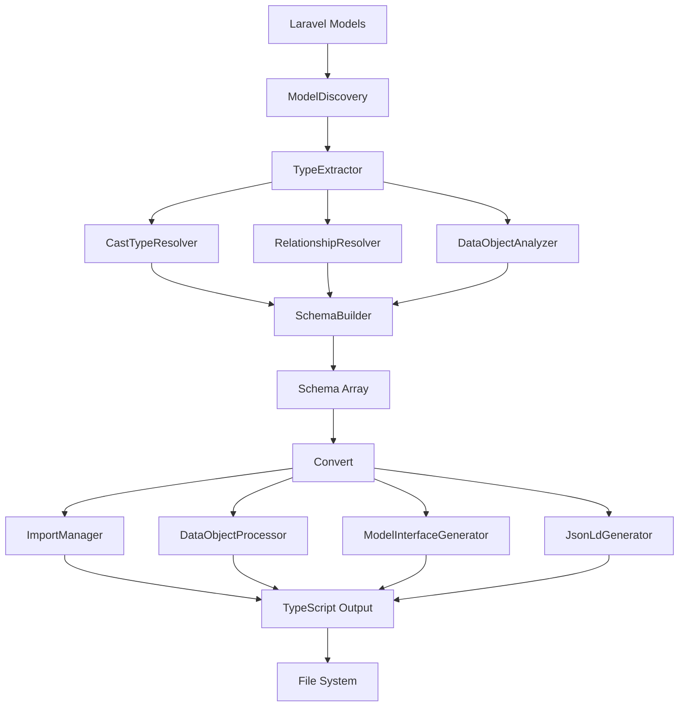

# OI Laravel TypeScript Package Architecture

This document describes the package architecture and the responsibility of each component.

## Overview

The package is organized according to a modular architecture with separation of concerns. Each class has a specific role in the PHP → TypeScript conversion process.

```
src/Services/
├── Convert.php                           # TypeScript conversion orchestrator
├── Eloquent.php                          # Facade for model analysis
├── Converters/
│   └── TypeScriptTypeConverter.php       # PHP → TS type conversion
├── Generators/
│   ├── ImportManager.php                 # TypeScript imports management
│   ├── JsonLdGenerator.php               # JSON-LD support generation
│   └── ModelInterfaceGenerator.php       # Model interfaces generation
├── Processors/
│   └── DataObjectProcessor.php           # DataObjects processing
└── Eloquent/
    ├── ModelDiscovery.php                # Model discovery
    ├── TypeExtractor.php                 # Type extraction from a model
    ├── SchemaBuilder.php                 # Global schema construction
    ├── RelationshipResolver.php          # Relationship resolution
    ├── CastTypeResolver.php              # Custom casts resolution
    ├── DataObjectAnalyzer.php            # DataObjects analysis
    └── PhpToTypeScriptConverter.php      # PHP → TS type conversion
```

## Modular Architecture

The architecture follows the **Facade + Specialized Services** pattern, with two main pipelines:

### Pipeline 1: Eloquent (Model Analysis)
```
Laravel Models
    ↓
ModelDiscovery → discovers models
    ↓
TypeExtractor → extracts types for each model
    ├→ CastTypeResolver → resolves custom casts
    ├→ RelationshipResolver → resolves relationships
    └→ DataObjectAnalyzer → analyzes DataObjects
    ↓
SchemaBuilder → builds the complete schema
    ↓
Schema (array)
```

### Pipeline 2: Convert (TypeScript Generation)
```
Schema
    ↓
Convert → orchestrates the conversion
    ├→ ImportManager → collects imports
    ├→ DataObjectProcessor → processes DataObjects
    ├→ ModelInterfaceGenerator → generates interfaces
    └→ JsonLdGenerator → adds JSON-LD support
    ↓
TypeScript File
```

---

## Eloquent Pipeline Components

### 1. Eloquent (Facade)
**File**: `src/Services/Eloquent.php`

**Responsibility**: Main entry point for Laravel model analysis.

**Role**:
- Static facade to simplify the public API
- Configures and assembles pipeline components
- Manages global configuration (customProps, additionalModels, withCounts)
- Delegates work to specialized services

**Public Methods**:
```php
// Configuration
public static function setAdditionalModels(array $models): void
public static function setCustomProps(array $props): void
public static function setWithCounts(bool $withCounts): void

// Extraction
public static function getSchema(): array
public static function getModels(): array
public static function getTypes(string $modelClass): Collection
```

**Usage Example**:
```php
// Configuration
Eloquent::setAdditionalModels([CustomModel::class]);
Eloquent::setCustomProps([
    'User' => ['role' => 'UserRole'],
    '?status' => 'Status' // Global
]);

// Extraction
$schema = Eloquent::getSchema();
```

---

### 2. ModelDiscovery (Model Discovery)
**File**: `src/Services/Eloquent/ModelDiscovery.php`

**Responsibility**: Discovers and collects all Eloquent models of the application.

**Role**:
- Scans the `app/Models` directory
- Integrates configured additional models
- Validates class existence
- Returns a normalized metadata array

**Key Methods**:
```php
public function setAdditionalModels(array $models): void
public function discoverModels(): array
private function scanModelsDirectory(): array
private function processAdditionalModels(): array
```

**Output**:
```php
[
    ['model' => 'User', 'namespace' => 'App\\Models\\User'],
    ['model' => 'Post', 'namespace' => 'App\\Models\\Post'],
]
```

---

### 3. TypeExtractor (Type Extraction)
**File**: `src/Services/Eloquent/TypeExtractor.php`

**Responsibility**: Extracts all type information from an Eloquent model.

**Role**:
- Combines data from multiple sources
- Coordinates specialized resolvers
- Applies custom props
- Generates a Collection of normalized types

**Extraction Process**:
1. Adds the primary key
2. Processes fillable attributes (+ custom casts)
3. Adds timestamps if enabled
4. Adds relationships (+ _count fields)
5. Adds remaining custom props

**Key Methods**:
```php
public function extractTypes(string $modelClass): Collection
private function processFillableAttributes(Model $model, Collection $types, array $customModelProps): void
private function addTimestamps(Model $model, Collection $types, array $customModelProps): void
private function addRelationships(Model $model, Collection $types): void
private function isCollectionRelationship(string $relationType): bool
```

**Dependencies**:
- `CastTypeResolver` for custom casts
- `RelationshipResolver` for relationships
- `customProps` for overrides

---

### 4. CastTypeResolver (Custom Casts Resolution)
**File**: `src/Services/Eloquent/CastTypeResolver.php`

**Responsibility**: Resolves Laravel custom casts to their TypeScript types.

**Role**:
- Identifies classes implementing `CastsAttributes`
- Analyzes `get()` methods to detect the return type
- Detects returned DataObjects
- Handles casts returning arrays
- Parses PHPDoc to extract array types

**Key Methods**:
```php
public function resolve(string $castClass, string $columnName): ?array
private function resolveClassReturnType(...): ?array
private function resolveArrayReturnType(...): ?array
private function resolveFullClassName(string $className, ReflectionClass $contextClass): string
```

**Resolution Examples**:
```php
// Cast returning a DataObject
class AddressCast implements CastsAttributes {
    public function get(...): Address { }
}
// → ['type' => 'Address', 'isDataObject' => true, 'properties' => [...]]

// Cast returning an array of DataObjects
class TagsCast implements CastsAttributes {
    /** @return array<int, Tag> */
    public function get(...): array { }
}
// → ['type' => 'Tag[]', 'isDataObject' => true, 'isArray' => true, ...]
```

---

### 5. RelationshipResolver (Relationship Resolution)
**File**: `src/Services/Eloquent/RelationshipResolver.php`

**Responsibility**: Detects and extracts metadata from Eloquent relationships.

**Role**:
- Scans model methods
- Identifies those returning a Relation
- Extracts relation type and related model
- Retrieves pivot information for BelongsToMany

**Key Methods**:
```php
public function resolveRelationships(Model $model): array
private function isRelationshipMethod(ReflectionMethod $reflection): bool
private function extractRelationshipData(Model $model, string $methodName): ?array
private function extractPivotInformation(Relation $relation): ?array
```

**Detected Relationship Types**:
- HasOne, HasMany
- BelongsTo, BelongsToMany
- MorphOne, MorphMany
- MorphTo, MorphToMany

**Output**:
```php
[
    'name' => 'posts',
    'type' => 'HasMany',
    'model' => 'App\\Models\\Post'
],
[
    'name' => 'roles',
    'type' => 'BelongsToMany',
    'model' => 'App\\Models\\Role',
    'pivot' => [
        'accessor' => 'pivot',
        'class' => 'Illuminate\\Database\\Eloquent\\Relations\\Pivot',
        'columns' => ['role_id', 'user_id']
    ]
]
```

---

### 6. DataObjectAnalyzer (DataObjects Analysis)
**File**: `src/Services/Eloquent/DataObjectAnalyzer.php`

**Responsibility**: Analyzes PHP DataObject classes to extract their structure.

**Role**:
- Validates that a class is a DataObject (fromArray/toArray)
- Extracts constructor properties
- Converts PHP types to TypeScript
- Parses PHPDoc annotations (preferred over native types)
- Handles nullable types and default values

**Key Methods**:
```php
public function isDataObject(ReflectionClass $reflection): bool
public function extractProperties(ReflectionClass $reflection): array
private function extractPhpDocTypes(string $docComment): array
private function convertReflectionType(\ReflectionType $paramType): string
```

**Extraction Example**:
```php
// For this DataObject:
class UserData {
    /**
     * @param array<int, string> $tags
     */
    public function __construct(
        public string $name,
        public ?int $age = null,
        public array $tags = []
    ) {}
}

// Result:
[
    ['name' => 'name', 'type' => 'string', 'nullable' => false, 'hasDefault' => false],
    ['name' => 'age', 'type' => 'number', 'nullable' => true, 'hasDefault' => true],
    ['name' => 'tags', 'type' => 'string[]', 'nullable' => false, 'hasDefault' => true],
]
```

---

### 7. PhpToTypeScriptConverter (PHP → TypeScript Conversion)
**File**: `src/Services/Eloquent/PhpToTypeScriptConverter.php`

**Responsibility**: Converts PHP types to their TypeScript equivalents.

**Role**:
- Conversion of native types (int → number, etc.)
- Handling of union types (string|int)
- Conversion of generics (array<int, T>)
- Conversion of Record types (array<string, T>)
- Support for custom DataObjects

**Key Methods**:
```php
public function convertPhpDocToTs(string $phpDocType): string
public function splitUnionType(string $type): array
public function phpTypeToTypeScript(string $phpType): string
private function convertSinglePhpDocType(string $phpDocType): string
private function convertRecordType(string $valueType): string
private function convertArrayType(string $itemType): string
```

**Conversion Table**:
```php
'int', 'integer' → 'number'
'float', 'double' → 'number'
'string' → 'string'
'bool', 'boolean' → 'boolean'
'array' → 'unknown[]'
'mixed' → 'unknown'
'object' → 'Record<string, unknown>'

// Generics
'array<int, string>' → 'string[]'
'array<string, mixed>' → 'Record<string, unknown>'
'array<string, User>' → 'Record<string, IUser>'
'string|int' → 'string | number'
'array<int, User>|null' → 'IUser[]' (null handled by nullable)
```

---

### 8. SchemaBuilder (Schema Construction)
**File**: `src/Services/Eloquent/SchemaBuilder.php`

**Responsibility**: Orchestrates the complete schema construction for all models.

**Role**:
- Coordinates ModelDiscovery and TypeExtractor
- Applies global custom props (with ?)
- Applies model-specific custom props
- Generates the final normalized schema

**Key Methods**:
```php
public function buildSchema(): array
public function setAdditionalModels(array $models): void
public function setCustomProps(array $props): void
public function setWithCounts(bool $withCounts): void
private function applyGlobalCustomProps(array &$schema): void
private function applyModelSpecificCustomProps(array &$schema): void
```

**Process**:
1. Discovers all models
2. Extracts types for each model
3. Applies global custom props (`?field`)
4. Applies model-specific custom props (`Model.field`)

**Generated Schema**:
```php
[
    'User' => [
        'model' => 'User',
        'namespace' => 'App\\Models\\User',
        'types' => Collection [
            ['field' => 'id', 'type' => 'number', 'relation' => false],
            ['field' => 'name', 'type' => 'string', 'relation' => false],
            ['field' => 'posts', 'type' => 'HasMany', 'relation' => true, 'model' => Post::class],
            ['field' => 'posts_count', 'type' => 'number', 'relation' => false],
        ]
    ]
]
```

---

## Convert Pipeline Components

### 9. Convert (Orchestrator)
**File**: `src/Services/Convert.php`

**Responsibility**: Orchestrates the conversion from schema to TypeScript.

**Role**:
- Coordinates all generators
- Manages the conversion flow
- Generates the final TypeScript file

**Key Methods**:
```php
public function __construct(array $schema, bool $withJsonLd = false)
public function generateFile(string $path): void
public function toTypeScript(): string
private function generateHeader(): string
private function generateImports(): string
private function processDataObjects(): string
private function processModels(): string
```

**Conversion Flow**:
1. Generates the header with metadata
2. Collects and generates imports
3. Processes DataObjects (+ nested)
4. Generates model interfaces
5. Adds JSON-LD (optional)

---

### 10. TypeScriptTypeConverter (TS Converter)
**File**: `src/Services/Converters/TypeScriptTypeConverter.php`

**Responsibility**: Converts schema types to TypeScript for generation.

**Role**:
- Converts column types
- Handles relationship types
- Applies nullability rules
- Generates import types

**Key Methods**:
```php
public function convertColumnType(string $columnType): string
public function convertRelationType(string $relationType, string $relatedModel): string
public function convertPhpDocToTypeScript(string $phpDocType): string
public function getSimpleTypeScriptType(string $phpType): string
```

---

### 11. DataObjectProcessor (DataObjects Processor)
**File**: `src/Services/Processors/DataObjectProcessor.php`

**Responsibility**: Generates TypeScript interfaces for DataObjects.

**Role**:
- Processes DataObjects from the schema
- Detects nested DataObjects
- Manages a processing queue
- Avoids duplicates

**Key Methods**:
```php
public function processDataObject(array $field): void
public function processNestedDataObject(string $dataObjectClass): void
public function detectNestedDataObjects(string $tsType): void
public function hasPendingDataObjects(): bool
public function getOutput(): string
```

---

### 12. ModelInterfaceGenerator (Interface Generator)
**File**: `src/Services/Generators/ModelInterfaceGenerator.php`

**Responsibility**: Generates TypeScript interfaces for models.

**Key Methods**:
```php
public function processModel(array $model): void
private function convertField(array $field): string
private function getTypeScriptType(array $field): string
private function isRequired(array $field): bool
```

---

### 13. ImportManager (Import Manager)
**File**: `src/Services/Generators/ImportManager.php`

**Responsibility**: Manages TypeScript imports.

**Key Methods**:
```php
public function collectImports(array $schema): void
public function generateImports(): string
```

---

### 14. JsonLdGenerator (JSON-LD Generator)
**File**: `src/Services/Generators/JsonLdGenerator.php`

**Responsibility**: Generates JSON-LD support.

**Key Methods**:
```php
public function generate(): string
```

---

## Complete Data Flow



## Design Principles

### 1. Single Responsibility Principle (SRP)
Each class has a single responsibility:
- **ModelDiscovery**: Model discovery only
- **TypeExtractor**: Type extraction only
- **CastTypeResolver**: Cast resolution only
- **RelationshipResolver**: Relationship resolution only
- etc.

### 2. Dependency Injection
Dependencies are injected via the constructor:
```php
class TypeExtractor {
    public function __construct(
        CastTypeResolver $castTypeResolver,
        RelationshipResolver $relationshipResolver,
        array $customProps = [],
        bool $withCounts = true
    ) {}
}
```

### 3. Composition Over Inheritance
Architecture based on composition of specialized services.

### 4. Facade Pattern
`Eloquent` and `Convert` are facades that simplify the public API.

## Extensibility

### Adding a New Cast Type

Extend `CastTypeResolver` or create a new resolver:

```php
class CustomCastResolver
{
    public function resolve(string $castClass, string $column): ?array
    {
        // Resolution logic
    }
}
```

### Adding a New Generator

Create in `Generators/` and integrate to `Convert`:

```php
class CustomGenerator
{
    public function generate(): string
    {
        // Generation logic
    }
}
```

## Testing

Each component can be tested independently:

```php
// Test ModelDiscovery
$discovery = new ModelDiscovery;
$models = $discovery->discoverModels();

// Test TypeExtractor
$extractor = new TypeExtractor(...);
$types = $extractor->extractTypes(User::class);

// Test CastTypeResolver
$resolver = new CastTypeResolver(...);
$info = $resolver->resolve(AddressCast::class, 'address');
```

## Performance

### Implemented Optimizations

1. **Processed DataObjects Cache** - Avoids duplicates
2. **Lazy Processing** - Nested DataObjects are only processed when needed
3. **Single Pass** - The schema is traversed only once
4. **Optimized Collections** - Using Laravel Collections

## Documentation

Each class and public method is documented with PHPDoc including:
- Detailed role description
- Parameter types with complex structures
- Return type with detailed structures
- Concrete usage examples
- Potential exceptions

## Maintenance

### Points of Attention

1. **Laravel Synchronization** - Follow new versions
2. **TypeScript Types** - Keep conversions up to date
3. **DataObjects** - Test with different patterns
4. **Custom Casts** - Ensure compatibility

## Conclusion

This modular architecture offers:
- ✅ Clear separation of responsibilities (SRP)
- ✅ Maximum testability (DI + isolation)
- ✅ Easy extensibility (OCP)
- ✅ Simplified maintenance (documentation)
- ✅ Optimal performance (caching + lazy)
- ✅ Simple public API (Facade)